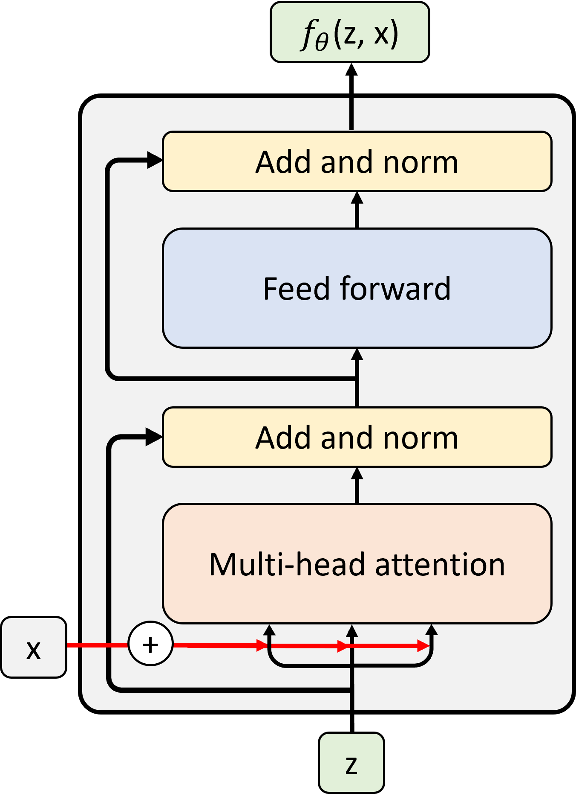
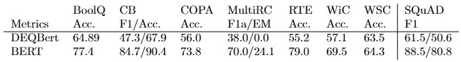
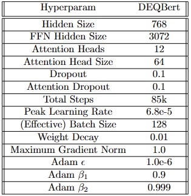

# Deep-Equilibrium-BERT


DEQBert does not really have massive difference from the original DEQ architecture. There are input injections (x) 
into the QKV matrices. The input injection is precomputed and cached for each forward iteration.

Find the pretrained weights for deqbert-base uploaded to huggingface hub 
here: https://huggingface.co/Clyde013/deqbert-base

The uploaded model is a DEQBertForMaskedLM model, to use it for fine-tuning you can load it with `.from_pretrained()` into
any other DEQBert model type such as DEQBertForQuestionAnswering or DEQBertForSequenceClassification. Huggingface will
automatically load the deqbert model without the masked language modelling head if it is not needed, initialising the
new model heads with random weights for fine-tuning.

Loading the model is as simple as:
```python
from DEQBert.modeling_deqbert import DEQBertForMaskedLM
model = DEQBertForMaskedLM.from_pretrained("Clyde013/deqbert-base")
```

Do note the performance of DEQBert does not come close to even matching regular BERT performance:




Suggestions are more than welcome.

# Future Work
- [ ] Profile to look for inefficiency in train loop. I really don't think it should take 15 days to train.
- [ ] Add wandb logging of NFEs
- [ ] neural DEQ solver? https://openreview.net/pdf?id=B0oHOwT5ENL
- [ ] jacobian free backprop? https://arxiv.org/pdf/2103.12803.pdf
- [ ] Deepnorm implementation?

# Environment Setup
```
pip list --format=freeze > requirements.txt
pip install -r requirements.txt
```

# Datasets

THE PILE (THANKS ELEUTHER VERY COOL) https://pile.eleuther.ai/

OSCAR https://huggingface.co/datasets/oscar

# Pretraining Hyperparameters


